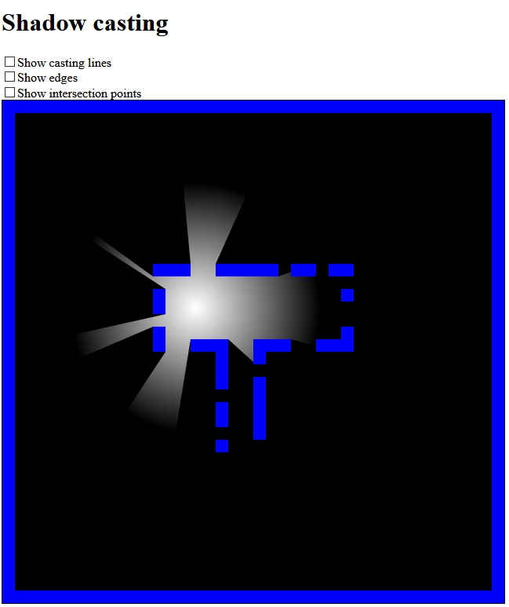

# Shadow casting demo in TypeScript

A shadow casting implementation in TypeScript based on [a YouTube video](https://www.youtube.com/watch?v=fc3nnG2CG8U&t=1939s) explains how to implement shadow casting in C++.

## How to build

```bash
npm run build
```

It creates `bundle.js` in `dist` directory.

## How to run

You can open the file `dist/index.html` in any browser.

## Screenshot
